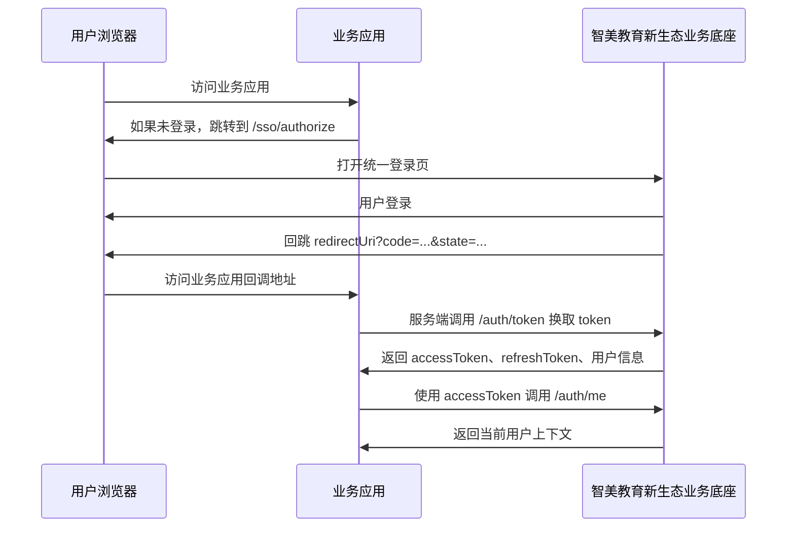

# 业务应用 API 接入指南

本文档面向接入智美教育新生态业务底座的业务应用开发者。业务应用可以部署在自己的服务器上，但用户账号、统一登录、用户上下文由智美教育新生态业务底座统一提供。

## 基本信息

开发环境地址：

```text
平台 API：http://localhost:3000/api/v1
统一登录入口：http://localhost:3000/sso/authorize
Swagger 文档：http://localhost:3000/api/docs
```

正式环境地址由平台管理员提供。接入正式环境时，请把本文档中的 `http://localhost:3000` 替换为正式平台域名。

## 接入前准备

每个业务应用需要先由平台管理员在后台登记，登记后会获得：

```text
appId：业务应用公开标识
appSecret：业务应用服务端密钥，只展示一次
redirectUri：业务应用登录回调地址
homeUrl：业务应用首页地址
```

示例开发应用：

```text
appId: demo-teaching-app
appSecret: demo-app-secret
redirectUri: http://localhost:3001/auth/callback
homeUrl: http://localhost:3001
```

注意：

- `appId` 可以出现在浏览器 URL 中。
- `appSecret` 只能保存在业务应用服务端，不能放到前端代码、浏览器、移动端包或公开仓库里。
- `redirectUri` 必须和平台后台登记的地址完全一致。

## 推荐登录流程

业务应用应使用浏览器跳转式统一登录。



## 第一步：跳转统一登录

业务应用发现用户未登录时，把浏览器重定向到：

```text
GET http://localhost:3000/sso/authorize
```

查询参数：

| 参数 | 必填 | 说明 |
| --- | --- | --- |
| `appId` | 是 | 平台分配的业务应用 ID |
| `redirectUri` | 是 | 登录完成后的业务应用回调地址 |
| `state` | 建议 | 业务应用生成的随机字符串，用于防止 CSRF |
| `scope` | 否 | 当前可传 `profile organization class` |

示例：

```text
http://localhost:3000/sso/authorize?appId=demo-teaching-app&redirectUri=http%3A%2F%2Flocalhost%3A3001%2Fauth%2Fcallback&state=demo-state&scope=profile%20organization%20class
```

登录成功后，平台会回跳业务应用：

```text
http://localhost:3001/auth/callback?code=AUTH_CODE&state=demo-state
```

业务应用需要校验返回的 `state` 是否和自己发起登录时保存的一致。

## 第二步：用 code 换 token

业务应用回调接口收到 `code` 后，必须在服务端调用：

```text
POST http://localhost:3000/api/v1/auth/token
```

请求体：

```json
{
  "appId": "demo-teaching-app",
  "appSecret": "demo-app-secret",
  "code": "AUTH_CODE",
  "redirectUri": "http://localhost:3001/auth/callback"
}
```

curl 示例：

```bash
curl -X POST http://localhost:3000/api/v1/auth/token \
  -H "Content-Type: application/json" \
  -d '{
    "appId": "demo-teaching-app",
    "appSecret": "demo-app-secret",
    "code": "AUTH_CODE",
    "redirectUri": "http://localhost:3001/auth/callback"
  }'
```

成功返回：

```json
{
  "accessToken": "eyJ...",
  "refreshToken": "eyJ...",
  "tokenType": "Bearer",
  "expiresIn": 900,
  "user": {
    "id": "user_id",
    "username": "admin",
    "email": "admin@example.com",
    "displayName": "平台管理员",
    "isPlatformAdmin": true
  }
}
```

说明：

- `code` 是一次性的，使用后会失效。
- `code` 有较短有效期，业务应用应在回调中立即换取 token。
- `accessToken` 用于访问平台 API。
- `refreshToken` 用于后续刷新登录态，第一阶段业务应用可以先只保存 `accessToken`。
- `expiresIn` 单位是秒。

## 第三步：获取当前用户上下文

业务应用拿到 `accessToken` 后，可以调用：

```text
GET http://localhost:3000/api/v1/auth/me
```

请求头：

```text
Authorization: Bearer ACCESS_TOKEN
```

curl 示例：

```bash
curl http://localhost:3000/api/v1/auth/me \
  -H "Authorization: Bearer ACCESS_TOKEN"
```

返回内容包含：

```json
{
  "user": {
    "id": "user_id",
    "username": "admin",
    "email": "admin@example.com",
    "displayName": "平台管理员",
    "isPlatformAdmin": true
  },
  "organizations": [],
  "classes": []
}
```

业务应用应使用平台返回的 `user.id` 作为统一用户 ID。不要在业务应用内重新生成另一套用户 ID 来表示同一个平台用户。

## Node.js SDK 用法

项目内提供了基础 SDK：

```text
packages/sdk
```

安装成 npm 包后，业务应用可以这样使用：

```ts
import { JiaoxuePlatformClient } from '@jiaoxue/sdk';

const platform = new JiaoxuePlatformClient({
  baseUrl: 'http://localhost:3000',
  appId: 'demo-teaching-app',
  appSecret: process.env.DEMO_APP_SECRET,
});

const authorizeUrl = platform.buildAuthorizeUrl({
  redirectUri: 'http://localhost:3001/auth/callback',
  state: 'random-state',
  scope: 'profile organization class',
});

const token = await platform.exchangeCode({
  code: 'AUTH_CODE',
  redirectUri: 'http://localhost:3001/auth/callback',
});

const me = await platform.getCurrentUser(token.accessToken);
```

如果暂时不使用 SDK，直接按上面的 HTTP 接口接入即可。

## 业务应用需要自己处理的事情

业务应用仍然需要自己处理：

- 自己的业务页面、业务数据库和业务数据权限。
- 登录后的业务应用 session 或 cookie。
- `state` 的生成、保存和校验。
- 用户退出业务应用后的本地 session 清理。
- 当 `accessToken` 过期时，重新走登录流程或接入 refresh token。

业务应用不需要自己处理：

- 用户注册和账号密码校验。
- 用户基础信息维护。
- 平台统一登录页面。
- 业务应用 `appSecret` 的签发。

## 安全要求

1. `appSecret` 只能放在服务端环境变量中。
2. 业务应用回调接口必须校验 `state`。
3. 生产环境必须使用 HTTPS。
4. 业务应用服务端不要把 `refreshToken` 返回给浏览器前端。
5. 不要把 `accessToken` 写入日志。
6. 如果怀疑 `appSecret` 泄露，需要立即联系平台管理员停用旧应用或重新签发密钥。

## 常见错误

### 授权回调参数无效

通常原因：

- 回调地址没有收到 `code`。
- 业务应用校验 `state` 失败。
- 发起登录时没有保存 `state`，回调时却要求必须匹配。

### Invalid application credentials

通常原因：

- `appId` 错误。
- `appSecret` 错误。
- 应用已被管理员停用。

### Invalid authorization code

通常原因：

- `code` 已经过期。
- `code` 已经使用过。
- `redirectUri` 和申请 code 时不一致。
- `code` 不是这个 `appId` 申请的。

### Missing bearer token

调用需要登录态的 API 时，没有传：

```text
Authorization: Bearer ACCESS_TOKEN
```

## 本地联调地址

本项目默认本地启动后：

```text
API / Swagger：http://localhost:3000/api/docs
统一登录：http://localhost:3000/sso/authorize
后台管理：http://localhost:5173
示例业务应用：http://localhost:3001
```

可以先用示例业务应用验证完整流程：

```text
http://localhost:3001
```

## 对接清单

业务应用上线前，请确认：

- 已从平台管理员处获得 `appId`、`appSecret`。
- 平台后台登记的 `redirectUri` 和业务应用实际回调地址一致。
- 业务应用能跳转到统一登录页。
- 回调接口能收到 `code` 和 `state`。
- 服务端能用 `code + appSecret` 换取 token。
- 能用 `accessToken` 调用 `/api/v1/auth/me`。
- 业务应用内部使用平台 `user.id` 作为统一用户标识。
- 生产环境已启用 HTTPS。

