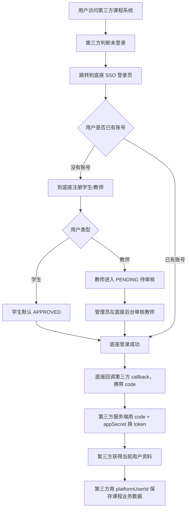

# 智美教育新生态业务底座第三方课程接入技术白皮书

版本：v0.1
更新日期：2026-05-30
适用对象：第三方课件、智能体、教学工具、练习系统开发者

> 重要说明：本文档保留的是“第三方独立站 / SSO 接入”的旧兼容模式，适合外部系统继续作为独立网站运行的场景。
> 当前内部课件和新课件开发，只需要阅读 `docs/14-courseware-integration-whitepaper-v2.md`。
> 新课件不建议再按本文的 SSO 独立站模式开发，而应接入 `agent.docpine.online/{courseSlug}/{coursewareSlug}/` 课程运行区。

> 当前业务底座已经升级为“教师/学生门户 + 课程课件运行区”模式。第三方独立站通过 SSO 接入仍可作为兼容方案，但新课件优先按 `agent.docpine.online/{courseSlug}/{coursewareSlug}` 两层课程运行区规范开发。内部课件统一白皮书见 `docs/14-courseware-integration-whitepaper-v2.md`。

## 1. 文档目的

本文档说明第三方课程系统如何接入“智美教育新生态业务底座”。

接入后的目标是：

- 教师、学生账号由业务底座统一注册、登录、审核和管理。
- 第三方课程系统不再自己注册平台用户，也不保存平台账号密码。
- 第三方课程系统通过 SSO 获取当前登录用户。
- 第三方课程系统通过只读 API 拉取授权范围内的教师、学生、学校、班级数据。
- 第三方课程系统用 `platformUserId` 关联自己的课程记录、练习记录、智能体会话记录等业务数据。

一句话原则：

```text
账号归底座，课程归第三方；用户数据从底座流向第三方，业务数据留在第三方。
```

## 2. 当前线上地址

```text
业务底座后台：
http://data.docpine.online

API Base URL：
http://data.docpine.online/api/v1

Swagger / OpenAPI 文档：
http://data.docpine.online/api/docs

学生注册短链接：
http://data.docpine.online/register/student

教师注册短链接：
http://data.docpine.online/register/teacher
```

## 3. 系统角色与职责边界

### 3.1 业务底座负责

- 学生注册。
- 教师注册。
- 用户邮箱、密码、姓名、身份类型、年龄段。
- 教师审核。
- 学校/机构管理。
- 班级管理。
- 用户与学校、班级的归属关系。
- 第三方业务应用登记。
- 第三方业务应用 `appId`、`appSecret` 管理。
- 第三方业务应用 SSO 回调地址管理。
- 第三方业务应用可访问的学校、班级范围管理。

### 3.2 第三方课程系统负责

- 自己的课程页面、练习页面、智能体页面。
- 自己的业务数据库。
- 学生练习记录、教师批改记录、测评结果、智能体对话记录等业务数据。
- 跳转到底座完成登录。
- 使用 SSO 回调拿到当前用户。
- 使用只读 API 拉取授权范围内的用户和班级数据。
- 在第三方业务库保存 `platformUserId` 作为统一用户关联键。

### 3.3 第三方课程系统不能做

- 不能在自己的系统内注册底座教师或学生。
- 不能保存底座账号密码。
- 不能反向同步创建底座用户。
- 不能修改底座用户资料、审核状态、学校班级归属。
- 不能读取未授权学校或班级的用户数据。
- 不能把 `appSecret` 放到前端、浏览器、移动端包或公开仓库。

## 4. 业务流程总览



## 5. 接入前准备

第三方课程正式接入前，需要平台管理员在业务底座后台完成应用登记。

### 5.1 平台管理员需要配置

- 应用名称，例如“普通话练习课件”。
- 应用 `appId`，例如 `mandarin-practice-app`。
- 应用 `appSecret`，只显示一次，需要交给第三方服务端保存。
- 应用首页 `homeUrl`，例如 `https://course.example.com`。
- SSO 回调地址 `redirectUris`，例如 `https://course.example.com/auth/callback`。
- 允许来源 `allowedOrigins`，例如 `https://course.example.com`。
- 应用可读取的学校/机构范围。
- 应用可读取的班级范围。

### 5.2 第三方开发者需要保存的线上配置

```bash
PLATFORM_PUBLIC_URL=http://data.docpine.online
PLATFORM_API_BASE_URL=http://data.docpine.online/api/v1

APP_ID=your-app-id
APP_SECRET=your-app-secret
APP_PUBLIC_URL=https://your-course-domain.example.com
APP_CALLBACK_URL=https://your-course-domain.example.com/auth/callback
```

`APP_SECRET` 必须只存在于第三方课程系统服务端。

## 6. 注册规则

当前规则已经调整为：

```text
教师和学生都在业务底座注册。
第三方课程系统不提供底座账号注册能力。
注册完成后的用户数据，通过 SSO token 或只读 API 传给第三方课程系统。
```

### 6.1 学生注册

学生注册入口：

```text
http://data.docpine.online/register/student
```

学生注册后：

- `userType = STUDENT`
- `approvalStatus = APPROVED`
- 可以直接登录第三方课程系统。
- 学校和班级可以由平台管理员后续分配。

### 6.2 教师注册

教师注册入口：

```text
http://data.docpine.online/register/teacher
```

教师注册后：

- `userType = TEACHER`
- `approvalStatus = PENDING`
- 需要平台管理员审核通过后才能登录第三方课程系统。

### 6.3 App 专属注册链接

上面的短链接适合公开分享，注册完成后显示底座默认注册完成页。

如果第三方课程希望用户注册后回到自己的课程系统，需要使用带 `appId` 和 `redirectUri` 的 SSO 注册地址：

```text
http://data.docpine.online/sso/register/student?appId=your-app-id&redirectUri=https%3A%2F%2Fyour-course-domain.example.com%2Fauth%2Fcallback
```

```text
http://data.docpine.online/sso/register/teacher?appId=your-app-id&redirectUri=https%3A%2F%2Fyour-course-domain.example.com%2Fauth%2Fcallback
```

注意：

- `redirectUri` 必须提前登记在业务底座应用配置里。
- 生产环境建议统一使用 HTTPS。
- 如果需要更短的 App 专属注册链接，可以由底座后续增加短链配置，例如 `/register/your-app/student`。

## 7. 登录接入流程

第三方课程系统不要自己校验底座密码。标准方式是 SSO。

### 7.1 第三方跳转到底座登录

用户访问第三方课程系统，如果没有第三方系统登录态，第三方系统将浏览器跳转到底座：

```text
GET http://data.docpine.online/sso/authorize?appId=your-app-id&redirectUri=https%3A%2F%2Fyour-course-domain.example.com%2Fauth%2Fcallback&state=random-state
```

参数说明：

| 参数 | 必填 | 说明 |
| --- | --- | --- |
| `appId` | 是 | 业务底座分配给第三方课程的应用 ID |
| `redirectUri` | 是 | 登录成功后的回调地址，必须已在底座后台登记 |
| `state` | 建议 | 第三方生成的随机字符串，用于防止 CSRF 和恢复跳转状态 |
| `scope` | 否 | 当前预留字段 |

### 7.2 底座回调第三方

用户在底座登录成功后，底座会跳回第三方回调地址：

```text
https://your-course-domain.example.com/auth/callback?code=one-time-code&state=random-state
```

第三方服务端需要校验：

- `state` 是否和自己登录前保存的一致。
- `code` 是否存在。

### 7.3 第三方服务端用 code 换 token

请求：

```http
POST /api/v1/auth/token
Host: data.docpine.online
Content-Type: application/json

{
  "appId": "your-app-id",
  "appSecret": "your-app-secret",
  "code": "one-time-code",
  "redirectUri": "https://your-course-domain.example.com/auth/callback"
}
```

返回示例：

```json
{
  "accessToken": "eyJhbGciOi...",
  "refreshToken": "raw-refresh-token",
  "tokenType": "Bearer",
  "expiresIn": 900,
  "user": {
    "id": "cmxxxplatformuserid",
    "username": null,
    "email": "student@example.com",
    "displayName": "学生姓名",
    "userType": "STUDENT",
    "approvalStatus": "APPROVED",
    "ageBand": "6-12岁",
    "isPlatformAdmin": false
  }
}
```

第三方课程系统应该保存：

- `user.id` 作为 `platformUserId`。
- `email`
- `displayName`
- `userType`
- `ageBand`

第三方课程系统不应保存：

- 底座密码。
- `appSecret` 到前端。
- 未加密的长期 token 到浏览器存储。

### 7.4 获取当前用户上下文

请求：

```http
GET /api/v1/auth/me
Host: data.docpine.online
Authorization: Bearer access_token
```

返回示例：

```json
{
  "user": {
    "id": "cmxxxplatformuserid",
    "username": null,
    "email": "student@example.com",
    "displayName": "学生姓名",
    "userType": "STUDENT",
    "approvalStatus": "APPROVED",
    "ageBand": "6-12岁",
    "isPlatformAdmin": false
  },
  "audience": "application",
  "appId": "your-app-id",
  "organizations": [
    {
      "id": "school-id",
      "name": "示例学校",
      "code": "demo-school",
      "type": "SCHOOL",
      "role": null
    }
  ],
  "classes": [
    {
      "id": "class-id",
      "name": "一班",
      "code": "class-1",
      "role": "student",
      "organization": {
        "id": "school-id",
        "name": "示例学校"
      }
    }
  ]
}
```

## 8. 第三方服务端只读 API

第三方服务端可以使用应用凭证读取授权范围内的平台用户。

所有只读接口使用以下请求头：

```text
X-App-Id: your-app-id
X-App-Secret: your-app-secret
```

### 8.1 读取授权用户列表

```http
GET /api/v1/app-auth/users?userType=STUDENT&limit=100
Host: data.docpine.online
X-App-Id: your-app-id
X-App-Secret: your-app-secret
```

查询参数：

| 参数 | 必填 | 说明 |
| --- | --- | --- |
| `userType` | 否 | `STUDENT`、`TEACHER`、`ADMIN` |
| `organizationId` | 否 | 按学校/机构筛选 |
| `classId` | 否 | 按班级筛选 |
| `limit` | 否 | 返回数量，范围 1-200，默认 100 |

返回示例：

```json
{
  "users": [
    {
      "platformUserId": "cmxxxstudentid",
      "email": "student@example.com",
      "username": null,
      "displayName": "学生姓名",
      "userType": "STUDENT",
      "ageBand": "6-12岁",
      "organizations": [
        {
          "id": "school-id",
          "name": "示例学校",
          "code": "demo-school",
          "type": "SCHOOL",
          "role": null
        }
      ],
      "classes": [
        {
          "id": "class-id",
          "name": "一班",
          "code": "class-1",
          "role": "student",
          "organization": {
            "id": "school-id",
            "name": "示例学校"
          }
        }
      ]
    }
  ]
}
```

使用建议：

- 第三方课程可以在后台任务中定时拉取用户快照。
- 第三方课程可以在教师进入班级页面时按 `classId` 拉取学生。
- 第三方课程只能拿到自己被授权的学校、班级用户。
- 如果底座后台没有给应用授权学校或班级，返回 `users: []`。

### 8.2 按邮箱查询单个用户

```http
GET /api/v1/app-auth/users/by-email?email=student@example.com
Host: data.docpine.online
X-App-Id: your-app-id
X-App-Secret: your-app-secret
```

返回示例：

```json
{
  "platformUserId": "cmxxxstudentid",
  "email": "student@example.com",
  "username": null,
  "displayName": "学生姓名",
  "userType": "STUDENT",
  "ageBand": "6-12岁",
  "organizations": [],
  "classes": []
}
```

如果用户不存在、未审核、被禁用，或者不在该应用授权范围内，返回 `404`。

### 8.3 已禁用的旧同步接口

旧接口：

```http
POST /api/v1/app-auth/users/sync
```

当前已禁用，调用会返回：

```text
403 Third-party user sync is disabled
```

禁用原因：

- 防止多个第三方系统各自注册同一个邮箱。
- 防止平台密码分散保存在多个系统。
- 防止账号归属和审核状态混乱。

## 9. 字段规范

### 9.1 用户字段

| 字段 | 类型 | 说明 |
| --- | --- | --- |
| `platformUserId` | string | 底座统一用户 ID，第三方业务数据必须用它关联用户 |
| `id` | string | token 返回中当前用户 ID，含义同 `platformUserId` |
| `email` | string | 全平台唯一邮箱 |
| `username` | string/null | 用户名，可为空 |
| `displayName` | string/null | 用户显示名称 |
| `userType` | enum | `STUDENT`、`TEACHER`、`ADMIN` |
| `approvalStatus` | enum | `APPROVED`、`PENDING`、`REJECTED` |
| `ageBand` | string/null | 学生年龄段 |
| `isPlatformAdmin` | boolean | 是否平台管理员 |
| `organizations` | array | 用户所属学校/机构 |
| `classes` | array | 用户所属班级 |

### 9.2 第三方业务库用户表建议

第三方课程系统可以在自己的业务库中建立用户快照表：

```sql
CREATE TABLE course_users (
  id BIGSERIAL PRIMARY KEY,
  platform_user_id TEXT NOT NULL UNIQUE,
  email TEXT NOT NULL,
  display_name TEXT,
  user_type TEXT NOT NULL,
  age_band TEXT,
  last_synced_at TIMESTAMP NOT NULL DEFAULT NOW(),
  created_at TIMESTAMP NOT NULL DEFAULT NOW(),
  updated_at TIMESTAMP NOT NULL DEFAULT NOW()
);
```

课程业务表应引用 `platform_user_id`：

```sql
CREATE TABLE practice_records (
  id BIGSERIAL PRIMARY KEY,
  platform_user_id TEXT NOT NULL,
  lesson_id TEXT NOT NULL,
  score INTEGER,
  detail JSONB,
  created_at TIMESTAMP NOT NULL DEFAULT NOW()
);
```

## 10. 第三方课程推荐实现

### 10.1 前端流程

1. 用户打开第三方课程首页。
2. 前端请求第三方自己的 `/api/me`。
3. 如果第三方系统未登录，跳转到底座 `/sso/authorize`。
4. 底座登录完成后回到第三方 `/auth/callback`。
5. 第三方服务端换 token，并建立第三方自己的登录 session。
6. 前端进入课程页面。

### 10.2 服务端 callback 伪代码

```js
app.get('/auth/callback', async (req, res) => {
  const { code, state } = req.query;

  assertStateIsValid(state);

  const tokenResponse = await fetch(`${PLATFORM_API_BASE_URL}/auth/token`, {
    method: 'POST',
    headers: { 'Content-Type': 'application/json' },
    body: JSON.stringify({
      appId: process.env.APP_ID,
      appSecret: process.env.APP_SECRET,
      code,
      redirectUri: process.env.APP_CALLBACK_URL,
    }),
  });

  if (!tokenResponse.ok) {
    return res.status(401).send('登录失败');
  }

  const data = await tokenResponse.json();
  const platformUserId = data.user.id;

  await upsertCourseUser({
    platformUserId,
    email: data.user.email,
    displayName: data.user.displayName,
    userType: data.user.userType,
    ageBand: data.user.ageBand,
  });

  createCourseSession(res, { platformUserId });
  res.redirect('/dashboard');
});
```

### 10.3 拉取班级学生伪代码

```js
async function fetchClassStudents(classId) {
  const response = await fetch(
    `${PLATFORM_API_BASE_URL}/app-auth/users?userType=STUDENT&classId=${encodeURIComponent(classId)}`,
    {
      headers: {
        'X-App-Id': process.env.APP_ID,
        'X-App-Secret': process.env.APP_SECRET,
      },
    },
  );

  if (!response.ok) {
    throw new Error(`读取学生失败：${response.status}`);
  }

  return response.json();
}
```

## 11. 错误码与处理建议

| 状态码 | 常见原因 | 第三方处理建议 |
| --- | --- | --- |
| `400` | 参数错误、`redirectUri` 未登记、`email` 缺失 | 检查请求参数和后台应用配置 |
| `401` | `appId/appSecret` 错误、code 无效、token 无效 | 重新登录，检查服务端环境变量 |
| `403` | 调用了已禁用接口或无权限 | 不要调用旧同步接口 |
| `404` | 用户不存在、未审核、被禁用、不在授权范围 | 提示用户联系管理员或重新分配班级 |
| `500` | 服务端异常 | 记录日志并联系底座维护方 |

## 12. 安全要求

- 生产环境必须使用 HTTPS。
- `appSecret` 只允许放在第三方服务端。
- 第三方前端不能直接调用带 `X-App-Secret` 的接口。
- 第三方系统应使用自己的 session 管理课程登录态。
- SSO 登录必须使用 `state` 防止 CSRF。
- 授权 code 一次性使用，过期后需要重新发起登录。
- 第三方只保存业务需要的用户快照，不保存平台密码。

## 13. 联调检查清单

第三方开发者接入时，请逐项确认：

- 已拿到 `APP_ID`。
- 已拿到 `APP_SECRET`。
- 第三方回调地址已配置到底座应用的 `redirectUris`。
- 第三方域名已配置到底座应用的 `allowedOrigins`。
- 底座后台已给该应用分配学校或班级访问范围。
- 可以打开底座登录地址。
- 登录后可以跳回第三方 `/auth/callback`。
- 第三方服务端可以用 `code` 换 token。
- token 返回的 `user.id` 已保存为第三方业务库中的 `platformUserId`。
- 可以调用 `/api/v1/auth/me` 获取当前用户上下文。
- 可以调用 `/api/v1/app-auth/users` 获取授权用户列表。
- 教师账号需要审核后才能登录。
- 学生账号注册后可以直接登录。

## 14. 最小 API 清单

第三方课程系统通常只需要以下接口：

| 用途 | 方法 | 地址 |
| --- | --- | --- |
| 跳转登录 | `GET` | `/sso/authorize` |
| code 换 token | `POST` | `/api/v1/auth/token` |
| 当前用户上下文 | `GET` | `/api/v1/auth/me` |
| 读取授权用户列表 | `GET` | `/api/v1/app-auth/users` |
| 按邮箱查用户 | `GET` | `/api/v1/app-auth/users/by-email` |

注册入口：

| 用途 | 地址 |
| --- | --- |
| 学生注册 | `http://data.docpine.online/register/student` |
| 教师注册 | `http://data.docpine.online/register/teacher` |

## 15. 标准交付给第三方的信息模板

平台方给第三方课程开发者时，可以按下面格式提供：

```text
项目名称：
智美教育新生态业务底座

业务底座地址：
http://data.docpine.online

API Base URL：
http://data.docpine.online/api/v1

Swagger：
http://data.docpine.online/api/docs

学生注册：
http://data.docpine.online/register/student

教师注册：
http://data.docpine.online/register/teacher

appId：
由平台管理员提供

appSecret：
由平台管理员单独安全发送，只能放服务端

第三方回调地址：
由第三方提供，平台管理员配置到 redirectUris

第三方可访问范围：
由平台管理员在后台配置学校/班级
```

## 16. 当前版本限制

- 当前没有 webhook 主动推送。
- 当前注册数据传给第三方的方式是：用户登录回调时通过 token 返回，或第三方服务端主动调用只读 API 拉取。
- 当前短注册链接是平台通用链接。
- 第三方专属短注册链接可以作为后续增强项。
- 当前第三方应用不能写入底座用户、学校、班级数据。

## 17. 推荐接入顺序

1. 第三方先提供正式域名和 `/auth/callback` 地址。
2. 平台管理员创建应用并配置回调地址。
3. 平台管理员给第三方 `appId` 和 `appSecret`。
4. 第三方实现 `/auth/callback`。
5. 第三方实现自己的登录 session。
6. 第三方用 `platformUserId` 建立业务库用户快照。
7. 第三方调用 `/app-auth/users` 拉取授权用户。
8. 平台管理员给应用授权学校和班级。
9. 双方完成学生登录、教师登录、班级学生读取的联调。
