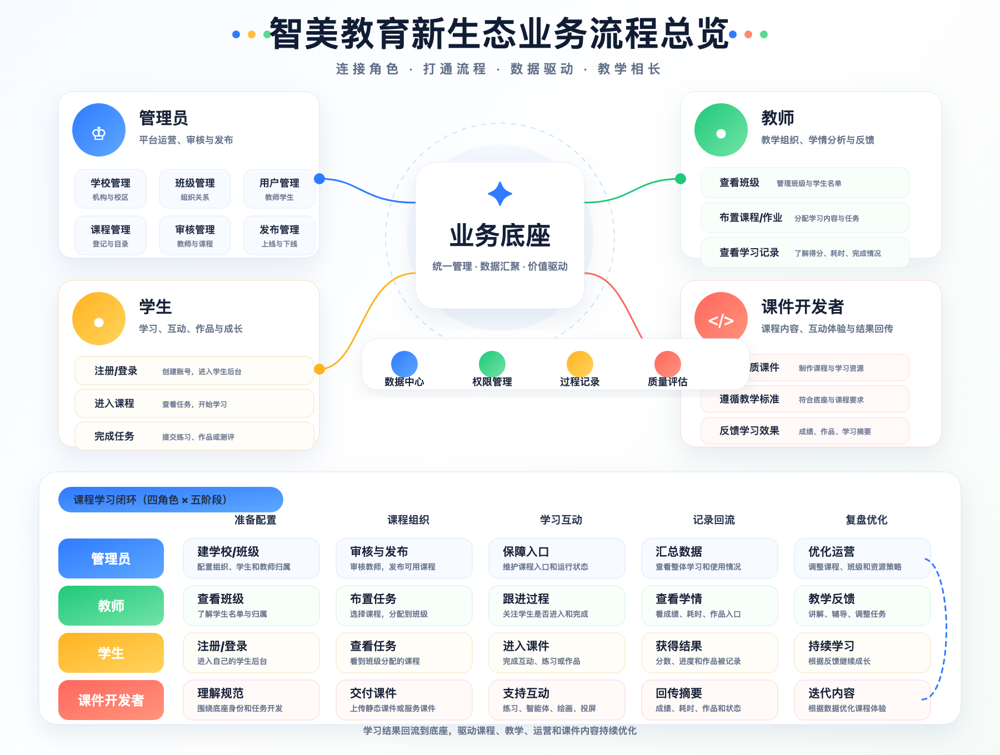

# 智美教育新生态业务流程总览

版本：v0.1  
更新日期：2026-06-02  
适用对象：平台管理者、教师、课件开发者、合作方、大模型业务梳理提示词

## 1. 一句话理解

智美教育新生态业务底座不是单纯的用户系统，而是一个教育业务运营底座。

它负责统一管理学生、教师、学校、班级、课程、任务和学习记录；课件开发者负责开发具体课程内容，学生在底座进入课件学习，学习结果再回到底座，教师和管理员可以统一查看。

核心原则：

```text
账号归底座，班级归底座，课程归底座管理，课件负责互动体验，学习结果回到底座。
```

## 2. 业务总览图



## 3. 四类角色

### 管理员

管理员负责平台的整体运营和配置。

主要工作：

- 管理学校和班级。
- 管理教师和学生。
- 审核教师账号。
- 创建和发布课程。
- 管理课件是否上线。
- 查看整体学习数据和运营状态。

### 教师

教师负责具体教学组织。

主要工作：

- 查看自己管理的班级。
- 查看班级学生名单。
- 给班级布置课程任务。
- 查看学生学习记录、成绩、耗时和完成情况。
- 根据学习结果进行讲解、反馈和后续教学安排。

### 学生

学生负责完成学习任务。

主要流程：

- 在底座完成学生注册。
- 登录学生后台。
- 查看自己的学校、班级、课程和任务。
- 点击任务进入课件。
- 完成学习、练习、互动或作品创作。
- 学习结果自动回到底座。

### 课件开发者

课件开发者负责课程内容和互动体验。

主要工作：

- 按底座规范开发课件。
- 交付课程页面、互动练习、智能体、作品保存或投屏能力。
- 通过底座提供的学生身份进入课程上下文。
- 把成绩、耗时、完成状态、作品入口等结果回传给底座。

课件开发者不负责注册底座用户，也不保存底座账号密码。

## 4. 业务对象关系

底座中的核心业务对象可以这样理解：

```text
学校
  -> 班级
      -> 教师
      -> 学生

课程
  -> 任务
      -> 学生学习
          -> 学习记录
              -> 教师查看
              -> 管理员汇总
```

其中：

- 学校和班级决定学生、教师的组织关系。
- 课程是可被布置的教学内容。
- 任务是教师把课程分配给某个班级后的教学安排。
- 学习记录是学生实际使用课件后的结果沉淀。

## 5. 核心业务流程

### 5.1 注册与审核

学生和教师都在业务底座注册。

学生注册后默认可以进入学生后台。教师注册后需要管理员审核，通过后才能进入教师后台。

这个设计保证了教师和学生身份由平台统一管理，避免不同课件各自维护一套账号造成混乱。

### 5.2 建立学校和班级

管理员在后台创建学校和班级，并把教师、学生分配到对应班级。

后续教师只能看到自己管理的班级，学生只能看到自己所属班级相关的课程和任务。

### 5.3 课程进入底座

管理员在底座创建课程，设置课程名称、课程短名、课程简介、运行方式和发布状态。

课件开发者把课件交付到底座指定的课程运行区。课程上线前由管理员检查和发布。

### 5.4 教师布置任务

教师在教师后台选择课程，并把课程布置给自己管理的班级。

任务可以理解为：某个班级在某个时间段内要完成某一门课程。

### 5.5 学生进入课件学习

学生登录学生后台，看到自己的课程和任务。

学生点击任务后，底座会生成一次课程进入凭证，并把学生带到对应课件。

课件通过这个凭证知道：当前学生是谁、属于哪个班级、正在完成哪个任务、对应哪门课程。

### 5.6 学习结果回到底座

学生在课件中完成学习后，课件把结果回传给底座。

底座记录的信息包括：

- 学习状态：开始、进行中、完成。
- 分数或评价结果。
- 学习耗时。
- 作品入口或投屏入口。
- 简要学习摘要。

教师可以在教师后台查看班级学生的学习结果，管理员可以从平台维度查看整体数据。

## 6. 底座与课件的边界

### 底座统一负责

- 教师注册。
- 学生注册。
- 登录和身份管理。
- 教师审核。
- 学校和班级。
- 用户归属关系。
- 课程登记。
- 课程发布。
- 教师布置任务。
- 学生课程入口。
- 学习记录汇总。

### 课件负责

- 教学内容设计。
- 页面和互动体验。
- 练习、测评、智能体、绘画、录音、投屏等具体功能。
- 复杂作品数据的保存。
- 把关键结果同步回底座。

简单理解：

```text
底座管人、班级、课程入口和结果；课件管内容、互动和作品细节。
```

## 7. 两类课件形态

### 静态课件

适合轻量课程，例如图文互动、选择题、简单练习、前端可计算分数的小游戏。

静态课件可以直接放到课程运行区，由底座提供入口。

### 带后台的课件

适合复杂课程，例如：

- 学生画画并保存作品。
- 录音或口语练习。
- AI 智能体对话。
- 教师投屏展示学生作品。
- 需要课件自己保存详细过程数据。

这类课件可以拥有自己的课件后台，但仍然要通过底座识别学生、班级和任务，并把关键学习结果回传给底座。

## 8. 当前线上入口

管理员后台：

```text
http://data.docpine.online
```

教师后台：

```text
http://teacher.docpine.online
```

学生后台：

```text
http://student.docpine.online
```

课件运行区：

```text
http://agent.docpine.online/{courseSlug}/
```

示例课程：

```text
http://agent.docpine.online/can-machines-learn/
```

## 9. 合作方开发课件时的业务口径

给课件开发者的简化说明可以这样表达：

```text
你不需要开发学生注册、教师注册、班级管理和登录系统。
这些由智美教育新生态业务底座统一提供。

你需要开发的是具体课程体验。
学生会从底座学生后台进入你的课件。
进入时，底座会告诉你的课件：当前学生、班级、任务和课程。

学生完成学习后，你的课件需要把学习状态、分数、耗时、作品入口等结果回传给底座。
教师之后在教师后台查看学生结果。
```

## 10. 适合作为大模型提示词的业务描述

如果要让大模型画业务逻辑图，可以使用下面这段提示词：

```text
请为“智美教育新生态业务底座”绘制一张业务流程图，少技术细节，多业务关系。

这个系统是一个儿童教育业务底座，不只是用户系统。它统一负责学生注册、教师注册、教师审核、学校、班级、课程、任务和学习记录。

管理员负责管理学校、班级、用户、课程发布和平台运营。
教师在教师后台查看自己班级，给班级布置课程任务，并查看学生学习记录、成绩、耗时和完成情况。
学生在学生后台查看自己的课程和任务，点击进入课件学习。
课件开发者负责开发具体课程内容，例如互动练习、智能体、绘画、录音、投屏等。
课件不负责注册底座用户，也不保存底座账号密码。

核心流程是：管理员建立学校班级和课程 -> 教师给班级布置课程任务 -> 学生进入课件学习 -> 课件产生分数、耗时、作品或学习摘要 -> 学习结果回到底座 -> 教师和管理员查看结果。

请突出四类角色：管理员、教师、学生、课件开发者。
请突出一个中心：业务底座。
请突出一条学习闭环：进入课程、学习互动、完成任务、生成记录、教师查看结果。
整体风格适合儿童教育行业，清爽、友好、有设计感。
```

## 11. 后续可扩展方向

后续可以继续扩展：

- 更完整的教师备课功能。
- 学生作品库。
- 家长查看入口。
- 课程收费和订单。
- 课程市场。
- 课件上传审核流程。
- 学习数据分析和成长报告。
- 多学校、多校区、多教师协作。
