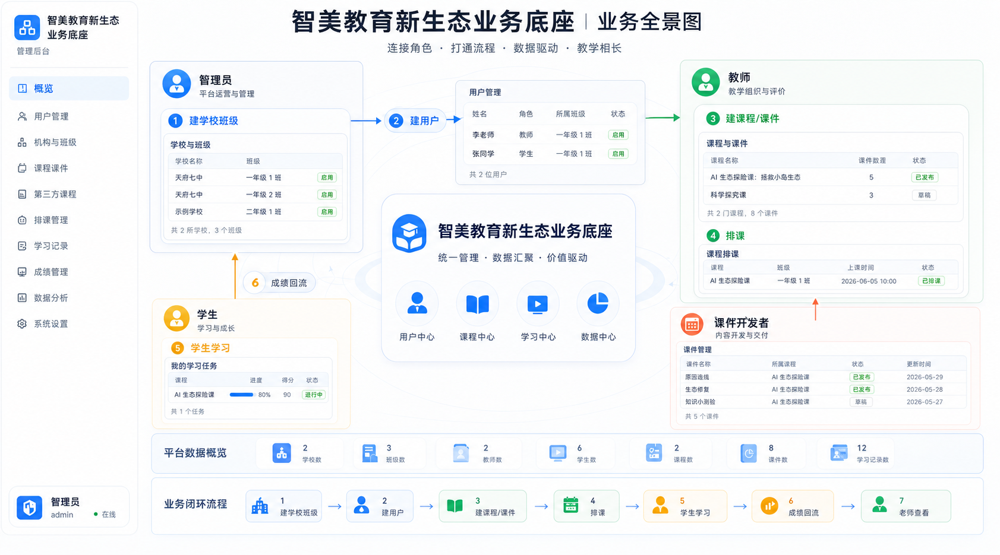
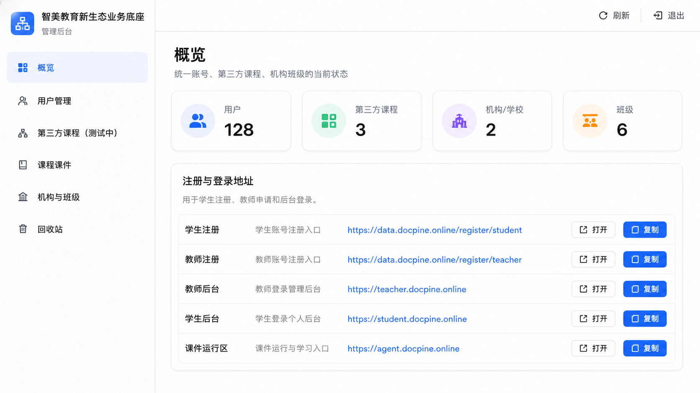
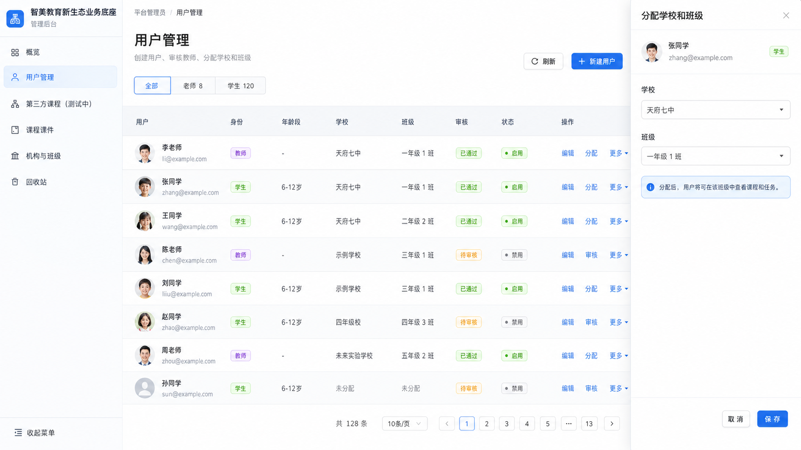
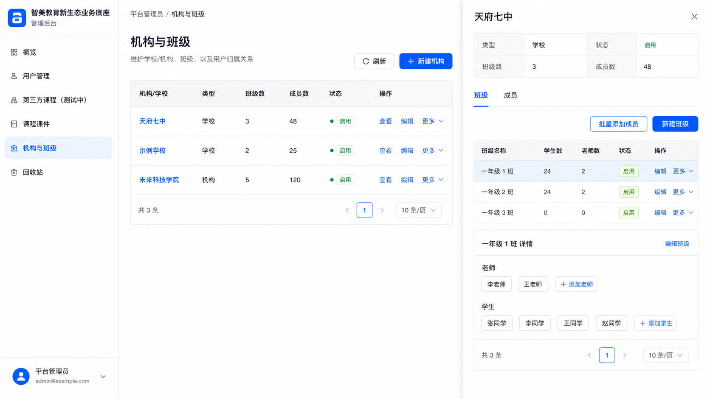
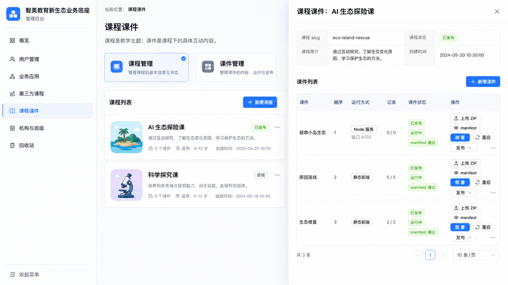
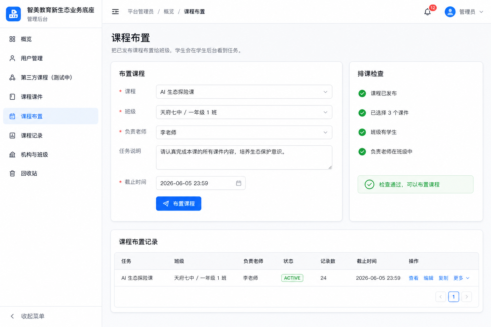
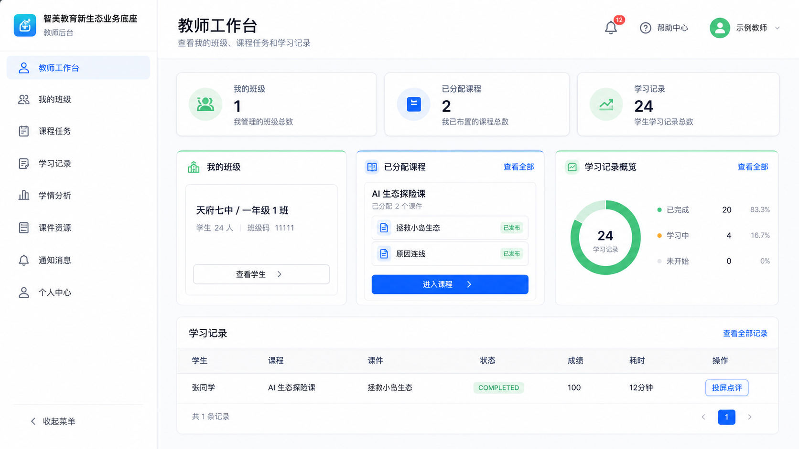
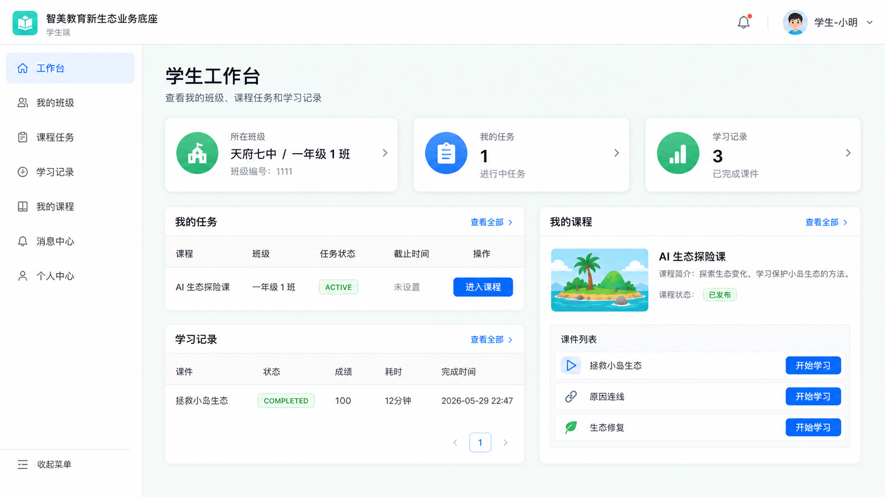
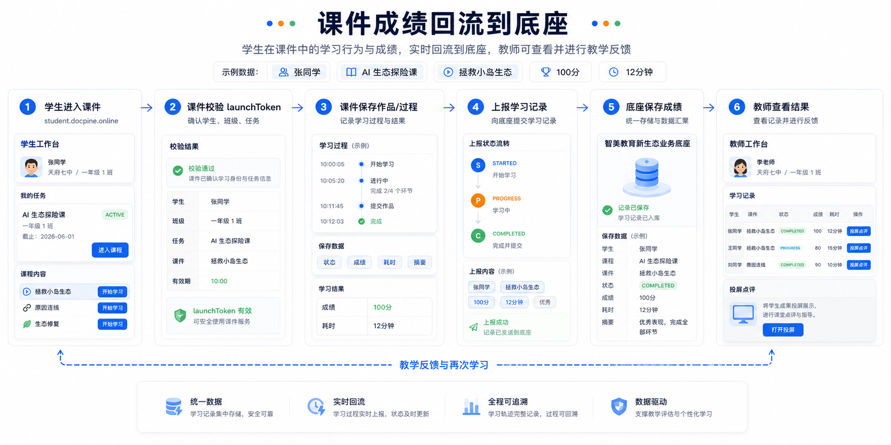

# 智美教育新生态业务底座使用手册

版本：2026-06-03  
适用对象：内部运营、平台管理员、教师、学生、课件开发者

本手册说明“智美教育新生态业务底座”的主要角色、入口和日常操作流程。底座统一维护教师、学生、学校、班级、课程、课件、排课任务和学习记录；课件负责具体学习互动，并把学生成绩、状态和摘要回传到底座。

## 1. 业务底座总览

### 1.1 线上入口

| 入口 | 地址 | 主要使用者 | 用途 |
| --- | --- | --- | --- |
| 管理员后台 | <http://data.docpine.online> | 平台管理员、内部运营 | 管理用户、学校班级、课程课件、排课和回收站 |
| 教师后台 | <http://teacher.docpine.online> | 已审核教师 | 查看班级、课程任务和学习记录 |
| 学生后台 | <http://student.docpine.online> | 学生 | 查看班级、任务、课程和学习记录 |
| 课件运行区 | <http://agent.docpine.online> | 学生、教师、课件 | 运行已发布课件 |

### 1.2 角色关系

| 角色 | 负责内容 | 不负责内容 |
| --- | --- | --- |
| 管理员 | 建学校班级、建用户、审核教师、管理课程课件、布置课程、查看回收站 | 不直接完成学生学习任务 |
| 教师 | 查看自己班级、查看被分配课程、查看学生学习记录、投屏点评 | 不创建平台底层用户，不管理所有班级 |
| 学生 | 登录学生后台、进入课程课件、完成学习并提交结果 | 不选择班级，不管理课程 |
| 课件开发者 | 开发课件、交付 ZIP、按规范回传成绩和状态 | 不拿服务器 root 权限，不直接管理教师/学生 |

### 1.3 业务闭环

1. 管理员创建学校和班级。
2. 管理员创建或审核教师、学生账号。
3. 管理员创建课程，并把一个或多个课件挂到课程下。
4. 管理员把课程布置给班级，并指定负责老师。
5. 学生在学生后台看到任务，进入课程后选择课件学习。
6. 课件记录学生过程、成绩、耗时和摘要，并回传到底座。
7. 教师在教师后台查看学习记录，必要时打开投屏点评。
8. 管理员和教师根据数据优化课程、班级和课件内容。

## 2. 管理员使用手册

管理员后台入口：<http://data.docpine.online>

管理员负责整个平台的基础数据和教学运行。建议按“学校班级 → 用户 → 课程课件 → 排课 → 查看记录”的顺序使用。

### 2.1 概览页

概览页用于快速查看平台状态和常用入口。

主要功能：

- 查看用户、第三方课程、学校、班级数量。
- 获取学生注册、教师注册、教师后台、学生后台、课件运行区地址。
- 复制或打开常用入口，便于发给老师、学生或运营人员。

注意事项：

- 概览页中的注册链接是公开入口，但不要在公开渠道发布管理员后台账号信息。
- 教师注册后仍需要管理员审核，学生注册后默认可用。

### 2.2 用户管理

用户管理用于创建、审核、启用、禁用和归属分配。

常用操作：

1. 进入“用户管理”。
2. 使用“老师 / 学生”筛选快速区分用户类型。
3. 点击“新建用户”创建教师或学生。
4. 对教师执行审核，通过后教师才能登录教师后台。
5. 给用户分配学校和班级。
6. 如用户暂不使用，可禁用账号；如需要删除，先移入回收站。

字段说明：

| 字段 | 含义 |
| --- | --- |
| 用户 | 显示姓名和邮箱 |
| 身份 | 学生、教师或管理员 |
| 年龄段 | 学生可填写，教师通常为空 |
| 学校 / 班级 | 用户所属组织关系 |
| 审核 | 教师必须审核通过，学生默认通过 |
| 状态 | 启用后可登录，禁用后不可登录 |

注意事项：

- 教师账号未审核通过时，不能进入教师后台。
- 学生未分配班级时可以有账号，但看不到班级课程任务。
- 删除用户前建议确认是否还有学习记录或班级关系。

### 2.3 机构与班级

机构与班级用于维护学校、班级和成员关系。

推荐流程：

1. 创建学校，例如“天府七中”。
2. 在学校下创建班级，例如“一年级 1 班”。
3. 进入班级详情，批量添加老师和学生。
4. 确认班级中至少有一个已审核启用的老师和若干学生。

班级成员规则：

- 一个班级可以有多个老师和多个学生。
- 排课时，负责老师必须已经在该班级中。
- 学生只有加入班级后，才能看到该班级被布置的课程任务。

注意事项：

- “学校”是组织容器，“班级”是排课和学习记录归属的核心单位。
- 如果老师后台看不到班级，先检查老师是否已加入该班级。
- 如果学生后台看不到任务，先检查学生是否已加入对应班级。

### 2.4 课程课件

当前底座采用“课程 + 课件”两层结构。

- 课程：教学主题容器，例如“AI 生态探险课”。
- 课件：课程下面的具体互动内容，例如“拯救小岛生态”。

管理员操作流程：

1. 进入“课程课件”。
2. 创建课程，填写课程名称、访问短名、简介和状态。
3. 创建或选择课件。
4. 上传课件 ZIP。
5. 查看 manifest 校验结果。
6. 如果是 Node 课件，点击“部署”或“重启”。
7. 发布课件，再发布课程。
8. 在课程详情中选择该课程包含的课件，最多暂定 5 个。

课件状态说明：

| 状态 | 含义 |
| --- | --- |
| 未上传 | 课件还没有上传 ZIP |
| manifest 异常 | ZIP 内 manifest 不符合规范 |
| manifest 通过 | ZIP 结构和 manifest 校验通过 |
| 运行中 | Node 课件服务已经启动 |
| 已发布 | 学生可以看到并进入该课件 |

注意事项：

- 课程发布后，教师才能把课程布置给班级。
- 学生只会看到已发布课程下的已发布课件。
- Node 课件需要部署或重启；静态课件一般上传校验后即可发布。
- 如果课件打不开，优先检查入口、manifest、运行状态和课程/课件是否发布。

### 2.5 课程布置

课程布置用于把已发布课程分配给班级，并指定负责老师。

排课前检查：

- 课程已发布。
- 课程下至少有 1 个已发布课件。
- 班级中已有学生。
- 负责老师已加入该班级，且账号已审核启用。

操作步骤：

1. 进入“课程布置”。
2. 选择课程，例如“AI 生态探险课”。
3. 选择学校和班级，例如“天府七中 / 一年级 1 班”。
4. 选择负责老师，例如“李老师”。
5. 填写任务说明和截止时间。
6. 点击“布置课程”。
7. 到“课程布置记录”确认任务状态为 ACTIVE。

布置完成后：

- 学生在学生后台“我的任务”看到该课程。
- 负责老师在教师后台看到该班级和课程任务。
- 学生进入课程并完成课件后，学习记录会回到底座。

### 2.6 回收站

回收站用于防止误删。

可进入回收站的对象：

- 学生
- 教师
- 课程
- 课件

操作规则：

- 第一次删除是“移入回收站”。
- 回收站内可以恢复。
- 在回收站再次删除才是永久删除。

注意事项：

- 回收站中的对象仍可能占用邮箱、课程访问短名或课件访问短名。
- 永久删除会清理关联关系和学习记录，操作前要确认。

## 3. 教师使用手册

教师后台入口：<http://teacher.docpine.online>

教师账号必须由管理员审核通过后才能登录教师后台。

### 3.1 查看我的班级

操作步骤：

1. 登录教师后台。
2. 查看“我的班级”。
3. 点击班级查看学生名单。

如果看不到班级：

- 确认管理员已把该教师加入班级。
- 确认教师账号审核状态为已通过。
- 确认账号状态为启用。

### 3.2 查看已分配课程

教师只能看到管理员分配给自己负责班级的课程任务。

操作步骤：

1. 在教师工作台查看“已分配课程”。
2. 找到课程，例如“AI 生态探险课”。
3. 查看课程下可用课件。
4. 可以点击进入课件进行演示或课堂讲解。

### 3.3 查看学习记录

学习记录包含：

- 学生
- 课程
- 课件
- 状态
- 成绩
- 耗时
- 摘要
- 投屏入口

状态说明：

| 状态 | 含义 |
| --- | --- |
| STARTED | 学生已经进入课件 |
| PROGRESS | 学生保存了学习进度 |
| COMPLETED | 学生提交了完成结果 |

教师可以根据记录判断学生是否进入、是否完成、分数如何，以及是否需要课堂点评。

### 3.4 投屏点评

如果课件支持投屏或作品展示，教师可以在学习记录中打开投屏入口。

适合场景：

- 展示学生画作。
- 展示学生答题过程。
- 展示学生课程成果。
- 做课堂集中点评。

## 4. 学生使用手册

学生后台入口：<http://student.docpine.online>

学生可以通过管理员提供的学生注册链接注册。学生注册完成后可以直接进入学生后台。

### 4.1 查看所在班级

学生登录后可以看到自己的学校和班级。

如果没有班级：

- 说明管理员还没有把学生加入班级。
- 学生可以登录，但暂时可能看不到课程任务。

### 4.2 查看我的任务

“我的任务”显示管理员布置给学生所在班级的课程。

操作步骤：

1. 登录学生后台。
2. 查看“我的任务”。
3. 点击“进入课程”。
4. 进入课程后选择具体课件。

### 4.3 进入课件学习

学生必须从学生后台进入课程和课件。底座会自动生成 launchToken，把学生、班级、任务、课程、课件上下文传给课件。

注意事项：

- 不建议直接复制课件运行区 URL 给学生使用。
- 直接打开课件可能缺少 launchToken，成绩无法回流。
- 学生进入课件后，底座会记录 STARTED。

### 4.4 保存进度与提交结果

课件可以支持两种动作：

- 保存当前进度：记录 PROGRESS，适合未完成时中途保存。
- 提交完成结果：记录 COMPLETED，同时保存成绩、耗时和摘要。

提交后，教师可以在教师后台看到学生记录。

### 4.5 查看学习记录

学生可以在学生后台查看自己的历史学习记录，包括课程、课件、状态、成绩和耗时。

## 5. 课件开发者使用手册

课件开发者负责具体课程体验，但不直接管理平台教师和学生。

### 5.1 开发边界

开发者可以做：

- 开发静态课件。
- 开发 Node 服务课件。
- 保存课件自己的业务数据，例如学生作品、绘画、语音、对话记录。
- 按底座规范回传学习状态、成绩、耗时和摘要。

开发者不应该做：

- 不要求学生重新注册课件账号。
- 不保存底座账号密码。
- 不直接管理底座中的教师、学生、学校和班级。
- 不获取服务器 root 权限。
- 不在课件中写入数据库密码、服务器密码或服务端密钥。

### 5.2 课件交付内容

课件通常以 ZIP 交付。

ZIP 内应包含：

- `manifest.json`
- 静态课件文件，或 Node 课件源码
- `package.json`，仅 Node 课件需要
- 必要的公开资源文件

manifest 至少说明：

| 字段 | 含义 |
| --- | --- |
| slug | 课件访问短名 |
| title | 课件名称 |
| runtimeType | STATIC、NODE 或 BOTH |
| entry | 课件入口 |
| nodePort | Node 课件端口，仅 Node 课件需要 |

### 5.3 学生身份获取

课件不能自己判断学生是谁。标准流程如下：

1. 学生登录学生后台。
2. 学生点击课程任务。
3. 学生选择课程下的课件。
4. 底座跳转到课件运行区，并携带 launchToken。
5. 课件用 launchToken 向底座校验。
6. 底座返回学生、班级、任务、课程、课件上下文。

### 5.4 成绩和状态回传

课件应把学习记录回传到底座。

建议回传字段：

| 字段 | 含义 |
| --- | --- |
| status | STARTED、PROGRESS、COMPLETED |
| score | 成绩 |
| durationSeconds | 学习耗时 |
| summary | 摘要数据，例如作品地址、答题结果、投屏地址 |

常见记录规则：

- 学生进入课件时，底座通常已记录 STARTED。
- 学生中途保存时，课件上报 PROGRESS。
- 学生提交最终结果时，课件上报 COMPLETED。
- 教师后台根据这些记录展示进度、成绩和投屏入口。

### 5.5 交付检查清单

课件交付前，开发者需要确认：

- ZIP 能正常解压。
- manifest 存在且字段正确。
- slug 与管理员后台登记一致。
- 静态课件入口可以打开。
- Node 课件可以监听指定端口。
- 课件能识别 launchToken。
- 课件能上报 PROGRESS 和 COMPLETED。
- 不包含服务器密码、数据库密码或其他敏感信息。

## 6. 常见问题

### 6.1 教师为什么不能登录？

常见原因：

- 教师账号还没有审核通过。
- 教师账号被禁用。
- 使用了学生账号进入教师后台。
- 管理员还没有给教师分配班级。

处理方式：

1. 管理员进入“用户管理”。
2. 检查教师审核状态。
3. 检查账号是否启用。
4. 进入“机构与班级”，确认教师已加入班级。

### 6.2 学生为什么看不到课程？

常见原因：

- 学生没有加入班级。
- 课程没有发布。
- 课程下没有已发布课件。
- 管理员还没有把课程布置给学生所在班级。

处理方式：

1. 检查学生是否属于正确班级。
2. 检查课程和课件是否发布。
3. 检查课程布置记录是否 ACTIVE。

### 6.3 课件为什么打不开？

常见原因：

- 课件未上传或 manifest 异常。
- Node 课件未部署或运行状态异常。
- 课程或课件未发布。
- 入口地址不正确。
- 学生不是从学生后台进入，缺少 launchToken。

处理方式：

1. 管理员进入“课程课件”。
2. 检查课件 manifest。
3. 检查课件运行状态。
4. 必要时点击“部署”或“重启”。
5. 从学生后台重新进入课件测试。

### 6.4 成绩为什么没有回流？

常见原因：

- 学生直接打开课件 URL，没有 launchToken。
- 课件没有调用学习记录上报接口。
- 课件只保存了自己的业务数据，没有同步到底座。
- 课程、课件、任务上下文不匹配。

处理方式：

1. 确认学生从学生后台进入课程。
2. 确认课件校验 launchToken 成功。
3. 确认课件上报 PROGRESS 或 COMPLETED。
4. 在教师后台刷新学习记录。

## 7. 第一版培训建议

建议按以下顺序培训内部人员：

1. 先讲业务闭环和四类角色。
2. 再演示管理员后台：用户、机构班级、课程课件、课程布置。
3. 接着演示教师后台：班级、课程、学习记录。
4. 然后演示学生后台：任务、进入课程、提交结果。
5. 最后给课件开发者讲 ZIP、manifest、launchToken 和成绩回传。

这份手册可作为第一版运营培训材料，也可以发给老师和课件开发者了解整个平台的使用边界。
